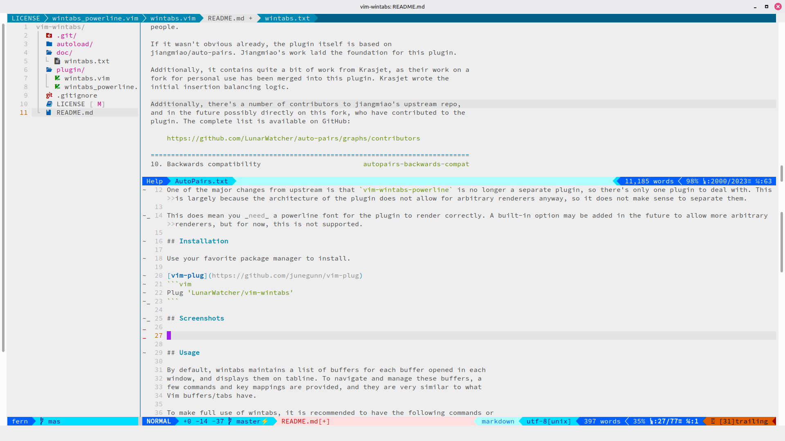

# vim-wintabs

Wintabs is a per-window buffer manager for Vim. It creates "tabs" for each 
buffer opened in every Vim window, and displays these buffers either on tabline 
or statusline. It brings persistent contexts to Vim windows and tabs, making 
them more awesome.

## Fork notes

This is a maintained fork of [zefei/vim-wintabs](https://github.com/zefei/vim-wintabs). Note that the plugin itself is currently considered feature-complete, so regular, major updates will not be happening. 

One of the major changes from upstream is that `vim-wintabs-powerline` is no longer a separate plugin, so there's only one plugin to deal with. This is largely because the architecture of the plugin does not allow for arbitrary renderers anyway, so it does not make sense to separate them.

This does mean you _need_ a powerline font for the plugin to render correctly. A built-in option may be added in the future to allow more arbitrary renderers, but for now, this is not supported.

## Installation

Use your favorite package manager to install. 

[vim-plug](https://github.com/junegunn/vim-plug)
```vim
Plug 'LunarWatcher/vim-wintabs'
```

## Screenshots



## Usage

By default, wintabs maintains a list of buffers for each buffer opened in each 
window, and displays them on tabline. To navigate and manage these buffers, a 
few commands and key mappings are provided, and they are very similar to what 
Vim buffers/tabs have.

To make full use of wintabs, it is recommended to have the following commands or 
keys mapped, these are the essential ones:

    commands             | mapping keys                 | replacing Vim commands
    ---------------------+------------------------------+-----------------------
    :WintabsNext         | <Plug>(wintabs_next)         | :bnext!
    :WintabsPrevious     | <Plug>(wintabs_previous)     | :bprevious!
    :WintabsClose        | <Plug>(wintabs_close)        | :bdelete
    :WintabsUndo         | <Plug>(wintabs_undo)         |
    :WintabsOnly         | <Plug>(wintabs_only)         |
    :WintabsCloseWindow  | <Plug>(wintabs_close_window) | :close, CTRL-W c
    :WintabsOnlyWindow   | <Plug>(wintabs_only_window)  | :only, CTRL-W o
    :WintabsCloseVimtab  | <Plug>(wintabs_close_vimtab) | :tabclose
    :WintabsOnlyVimtab   | <Plug>(wintabs_only_vimtab)  | :tabonly

Below is an example of key mappings:

    map <C-H> <Plug>(wintabs_previous)
    map <C-L> <Plug>(wintabs_next)
    map <C-T>c <Plug>(wintabs_close)
    map <C-T>u <Plug>(wintabs_undo)
    map <C-T>o <Plug>(wintabs_only)
    map <C-W>c <Plug>(wintabs_close_window)
    map <C-W>o <Plug>(wintabs_only_window)
    command! Tabc WintabsCloseVimtab
    command! Tabo WintabsOnlyVimtab

See `:help wintabs-commands` for all available commands and mappings.

Wintabs can display buffers on either tabline or statusline. It's recommended to 
use tabline if you typically work without using split windows; otherwise, 
statusline is recommended. If Wintabs is set to use statusline, it automatically 
moves your original statusline content to tabline.

## Configuration

Wintabs has a handful of configuration options, see `:help wintabs-options` for 
details.

## License

MIT License.
